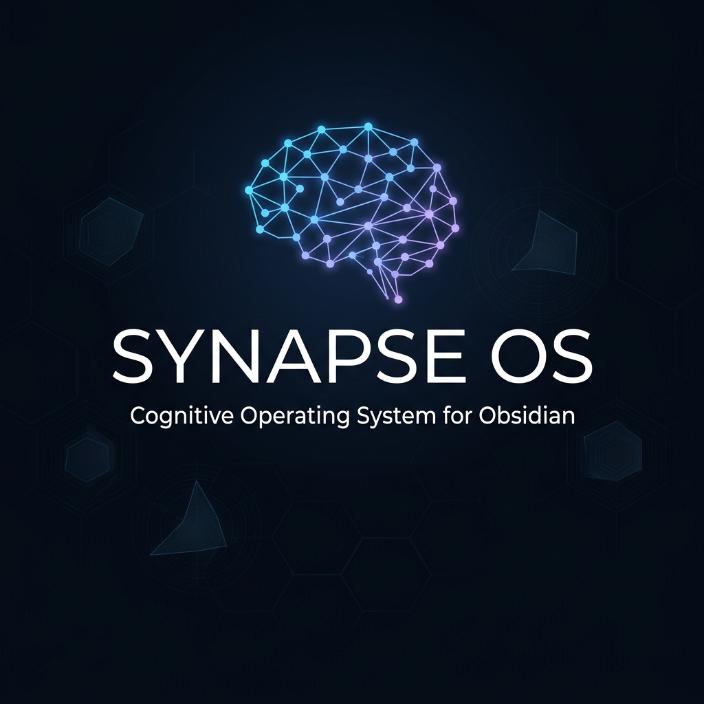

<p align="center">
  
</p>

<h1 align="center">🧠 Synapse OS</h1>

<p align="center">
  <strong>A Cognitive Operating System for your Obsidian Vault</strong><br/>
  Turn your second brain into a mirror that thinks back.
</p>

<p align="center">
  <a href="#what-is-synapse-os">What is it</a> •
  <a href="#installation">Install</a> •
  <a href="#how-it-works">How it Works</a> •  
  <a href="#agent-skills">Agent Skills</a> •
  <a href="#ide-setup">IDE Setup</a> •
  <a href="docs/SETUP_GUIDE.md">Full Setup Guide</a> •
  <a href="#faq">FAQ</a>
</p>

<p align="center">
  
  
  
  
</p>

---

## What is Synapse OS?

Most people treat Obsidian as a **storage system** — a place to dump notes in hopes they'll be useful "someday." But notes don't think. They sit in quiet folders, slowly becoming a **knowledge cemetery.**

**Synapse OS changes that.**

Inspired by [Andrej Karpathy's vision of Obsidian as an AI-augmented graph knowledge base](https://x.com/karpathy), Synapse OS consists of two tightly integrated components:

1. **An Obsidian Plugin** — silently tracks your reading and writing activity across every note (telemetry), builds a semantic index of your vault, and renders a live **Radar Dashboard** with a beautiful chart directly inside Obsidian.

2. **AI Agent Skills** — instruction files that turn any AI coding assistant (Antigravity, Claude Code, Cursor, Codex, Windsurf) into a **cognitive psychologist** for your vault. The agent reads your telemetry, finds contradictions in your thinking, connects forgotten notes to active ones, and asks you the uncomfortable questions you've been avoiding.

### What You Get

Once installed, Synapse OS gives you something no other note-taking tool offers — **an AI partner that actually thinks with you:**

- 🔍 **Contradiction Detection** — The agent cross-references your notes and finds places where your thinking contradicts itself. You wrote "health is my priority" six months ago but haven't touched a single health-related note since? The agent will call that out.

- 🔗 **Forgotten Knowledge Revival** — Notes you wrote months ago and never revisited aren't dead weight. The agent connects them to your current active topics, surfacing unexpected insights and opportunities you'd never find by browsing folders.

- 🎯 **Life Balance Visualization** — A live Radar Chart tracks how you actually spend your cognitive energy across six life areas (Health, Career, Intellect, Hobbies, Creativity, Purpose). Not what you *say* matters — what your behavior *shows* matters.

- 🪞 **Honest Reflection** — The agent asks a Shadow Question each session — designed to surface the one truth about your behavior that you're most likely avoiding. If it's comfortable, it's not working.

- 📈 **Progressive Profiling** — Over time, the agent builds a psychological profile of your habits, verified facts, and behavioral patterns. Every interaction makes it sharper — and harder to fool.

- 🛡️ **Full Control, Zero Risk** — The agent never edits your notes directly. Every proposed change goes through a safe Draft Buffer with a visual diff review. You always have the final word.

In short: **your vault becomes a mirror that reveals not just what you know, but what you avoid, what you forgot, and where you're stagnating.**

### The Core Loop

```
You write notes → Plugin tracks activity → Agent reads telemetry →
Agent finds contradictions → You resolve them → You evolve → Repeat
```

> **This is not a note organizer.** This is a system that confronts you with the patterns your notes reveal about your thinking, your avoidance, and your growth.

### What the Agent Actually Does

| Command | Name | What it does |
|:---|:---|:---|
| `@synapse-brain` | **The Mirror** | Scans your vault for **3 friction points** (contradictions between notes), generates a **Wildcard Spark** (connects a "dead" note to an active one), and asks a **Shadow Question** (the most uncomfortable truth about your behavior). |
| `@synapse-life` | **The Strategist** | Analyzes your **lowest Radar scores** vs. your declared life purpose. Calls out avoidance patterns. Builds a progressive psychological profile that improves with every interaction. |

### The Radar

The plugin renders a **6-axis Radar Chart** inside Obsidian, calculated from your actual read/write time across notes:

- **Health** • **Career** • **Intellect** • **Hobbies** • **Creativity** • **Purpose**

The formula: `Score = (WriteTime × 0.7) + (ReadTime × 0.3)` — because *reading* about fitness is a 3/10 activity, but *writing* a workout plan is a 10/10.

---

## Installation

> **📖 For a comprehensive walkthrough with screenshots and troubleshooting, see the [Full Setup Guide](docs/SETUP_GUIDE.md).**

### Prerequisites

- [Obsidian](https://obsidian.md) (v1.5.0+)
- An AI coding IDE with agent/skill support (see [IDE Setup](#ide-setup))
- Node.js 18+ (only if building from source)

### Step 1: Install the Obsidian Plugin

#### Option A: Download Release (Recommended)

1. Download the latest release from [Releases](https://github.com/macek166/Synapse-OS/releases)
2. Extract `main.js`, `manifest.json`, `styles.css` into:
   ```
   <your-vault>/.obsidian/plugins/synapse-os/
   ```
3. Restart Obsidian → **Settings → Community Plugins** → Enable **Synapse OS**

#### Option B: Build from Source

```bash
git clone https://github.com/macek166/Synapse-OS.git
cd Synapse-OS
npm install
npm run build
```

Then copy `main.js`, `manifest.json`, and `styles.css` to your vault's `.obsidian/plugins/synapse-os/` directory.

### Step 2: Install the Agent Skills

Copy the `agent-skills/` folders into your IDE workspace's `.agent/skills/` directory:

```bash
# From the cloned repo:
cp -r agent-skills/synapse-os    <your-workspace>/.agent/skills/
cp -r agent-skills/synapse-brain  <your-workspace>/.agent/skills/
cp -r agent-skills/synapse-life   <your-workspace>/.agent/skills/
```

**Windows (PowerShell):**
```powershell
Copy-Item -Recurse agent-skills\synapse-os    <your-workspace>\.agent\skills\
Copy-Item -Recurse agent-skills\synapse-brain  <your-workspace>\.agent\skills\
Copy-Item -Recurse agent-skills\synapse-life   <your-workspace>\.agent\skills\
```

> **Important:** Your IDE workspace must include (or have access to) your Obsidian vault directory. The agent needs to read/write files inside `_Synapse/`.

### Step 3: First Run

1. Open your vault in Obsidian — the plugin automatically creates a `_Synapse/` folder
2. Use Obsidian normally for a few hours (the plugin silently tracks read/write time)
3. Run **Synapse OS: Run Semantic Inventory** from the command palette (`Ctrl+P`)
4. Open your AI agent and type `@synapse-brain` — the magic begins

---

## How it Works

### Architecture

```
┌─────────────────────────────────────────────────────┐
│                 YOUR OBSIDIAN VAULT                  │
│                                                      │
│  ┌──────────────┐    ┌────────────────────────────┐  │
│  │ Your Notes   │───▶│  Synapse OS Plugin          │  │
│  │ (md files)   │    │  • Telemetry tracking       │  │
│  └──────────────┘    │  • Semantic indexing         │  │
│                      │  • Radar Dashboard UI        │  │
│                      └──────────────┬──────────────┘  │
│                                     │ writes           │
│                      ┌──────────────▼──────────────┐  │
│                      │  _Synapse/ directory          │  │
│                      │  • activity_log.json          │  │
│                      │  • synapse-index.json         │  │
│                      │  • Dashboard_Data.md          │  │
│                      │  • User_Profile.md            │  │
│                      │  • Draft_Buffer.md            │  │
│                      └──────────────▲──────────────┘  │
│                                     │ reads & writes   │
│                      ┌──────────────┴──────────────┐  │
│                      │  AI Agent (via your IDE)      │  │
│                      │  • @synapse-brain skill       │  │
│                      │  • @synapse-life skill        │  │
│                      └───────────────────────────────┘  │
└─────────────────────────────────────────────────────┘
```

### System Files (Created Automatically)

| File | Purpose |
|:---|:---|
| `_Synapse/activity_log.json` | Per-file read/write time in milliseconds |
| `_Synapse/synapse-index.json` | Flat-file semantic map of your vault (filenames, tags, key claims) |
| `_Synapse/Dashboard_Data.md` | Radar scores + Friction Points + Shadow Question (rendered by the plugin UI) |
| `_Synapse/User_Profile.md` | Agent's long-term memory: verified facts, habits, shadow patterns |
| `_Synapse/Draft_Buffer.md` | Safe edit buffer — agent proposes changes here, never touching your notes directly |

### The Safe-Edit Buffer

This is a **critical safety feature.** The AI agent **never modifies your notes directly.** Every proposed change is written to `Draft_Buffer.md` first, in a structured diff format. You review it in the plugin's modal UI and click **Accept** or **Discard.**

```markdown
# Target Note
[[Name_Of_Your_Note.md]]

# Proposed Content
[The rewritten note content appears here...]
```

### Epistemic Assessment

The agent doesn't just read your notes — it performs **linguistic forensics**:

- **Solid Knowledge** = assertive language, citations, high write-time
- **Vague Knowledge** = hedging ("maybe", "probably"), lack of structure, low write-time
- Each claim gets an `epistemic_score` (0–1) used to prioritize which contradictions matter most

---

## Agent Skills

The system ships with three agent skill files:

### `synapse-os` — Core Brain
The master instruction set. Contains all protocols, formulas, and behavioral rules. This is the "operating system" that the other two skills reference.

### `synapse-brain` — The Mirror
A shortcut skill that triggers the `/synapse-brain` protocol:
- **Friction Search** → finds 3 contradictions in your vault
- **Wildcard Spark** → connects a dead note to an active one
- **Shadow Question** → the most uncomfortable truth
- Updates Dashboard and Draft Buffer

### `synapse-life` — The Strategist
A shortcut skill that triggers the `/synapse-life` protocol:
- **Shadow Archetype** → finds your lowest Radar area vs. declared purpose
- **Progressive Profiling** → asks questions, builds long-term memory
- Updates User Profile and Dashboard

---

## IDE Setup

Synapse OS agent skills work with **any AI coding IDE** that supports the `.agent/skills/` convention with `SKILL.md` files.

> **📖 For detailed per-IDE instructions, see the [Full Setup Guide](docs/SETUP_GUIDE.md#4-connect-your-ide-to-your-vault).**

### Quick Reference

| IDE | Setup |
|:---|:---|
| **Google Antigravity** | Place skills in `<workspace>/.agent/skills/`. Use `@synapse-brain` in chat. Works with Obsidian MCP tools. |
| **Claude Code** | Place skills in project `.agent/skills/`. Use `@synapse-brain`. |
| **Cursor** | Place skills in workspace `.agent/skills/`. Use Agent mode + `@synapse-brain`. |
| **OpenAI Codex** | Place skills in project `.agent/skills/`. Reference via `@synapse-brain`. |
| **Windsurf** | Place skills in workspace `.agent/skills/`. Use AI assistant + `@synapse-brain`. |

**Key requirement:** Your IDE workspace must include or have access to your Obsidian vault directory. The agent reads and writes files inside the vault.

> **💡 Tip:** If your IDE workspace is separate from your vault, symlink the vault into your workspace or point the agent to the vault's absolute path.

---

## Plugin Commands

Accessible via `Ctrl+P` (or `Cmd+P` on macOS):

| Command | Description |
|:---|:---|
| **Synapse OS: Run Semantic Inventory** | Scans all markdown files and builds `synapse-index.json` |
| **Synapse OS: Open Dashboard** | Opens the Radar Dashboard in the right sidebar |
| **Synapse OS: Review Pending Draft** | Opens the diff-review modal for proposed agent edits |

You can also click the **🧠 brain icon** in the ribbon to open the dashboard.

---

## Configuration

The plugin uses sensible defaults. You can customize them in Settings (or `data.json`):

| Setting | Default | Description |
|:---|:---|:---|
| `synapseDir` | `_Synapse` | Directory for all Synapse system files |
| `idleTimeoutMs` | `120000` (2 min) | Stop tracking after this idle period |
| `flushIntervalMs` | `60000` (1 min) | How often telemetry is saved to disk |

---

## Project Structure

```
Synapse-OS/
├── src/                          # Plugin source code (TypeScript)
│   ├── main.ts                   # Plugin entry point
│   ├── Storage.ts                # JSON file read/write abstraction
│   ├── data/
│   │   └── types.ts              # TypeScript interfaces & defaults
│   ├── modules/
│   │   ├── Telemetry.ts          # Read/write time tracking engine
│   │   └── Indexer.ts            # Semantic vault scanner
│   └── ui/
│       ├── DashboardView.ts      # Radar chart + dashboard renderer
│       └── DraftMergeModal.ts    # Diff review & merge modal
├── agent-skills/                 # AI agent instruction files
│   ├── synapse-os/SKILL.md       # Core brain (all protocols)
│   ├── synapse-brain/SKILL.md    # Shortcut: The Mirror
│   └── synapse-life/SKILL.md     # Shortcut: The Strategist
├── templates/                    # Starter templates for _Synapse/ files
│   ├── Dashboard_Data.md         # Empty dashboard with zero scores
│   ├── User_Profile.md           # Blank profile scaffold  
│   └── Draft_Buffer.md           # Empty draft buffer
├── docs/                         # Documentation
│   ├── SETUP_GUIDE.md            # Comprehensive setup walkthrough
│   ├── CONTRIBUTING.md           # How to contribute
│   └── assets/                   # Images for docs
├── main.js                       # Built plugin (ready to install)
├── manifest.json                 # Obsidian plugin manifest
├── styles.css                    # Dashboard & modal CSS
├── package.json                  # Node.js dependencies
├── tsconfig.json                 # TypeScript config
├── esbuild.config.mjs            # Build script
└── LICENSE                       # MIT License
```

---

## Philosophy

Traditional note-taking asks: *"What do you want to remember?"*

Synapse OS asks: ***"What are you avoiding?"***

Your vault isn't a filing cabinet. It's a living model of your mind — complete with blind spots, contradictions, and abandonments. Synapse OS doesn't organize your notes. It **confronts you with the patterns they reveal.**

The Radar doesn't measure how many notes you have. It measures where you actually **spend your cognitive energy** — write-time weighted 70%, read-time 30%. You can't fake engagement.

The Shadow Question is designed to be uncomfortable. If it isn't, the system isn't working.

---

## FAQ

<details>
<summary><strong>Does this send my notes to the cloud?</strong></summary>

No. The Obsidian plugin is 100% local. Your notes never leave your machine. The AI agent reads files through your IDE's local file system access — no external APIs are involved in the telemetry or indexing process.

The AI agent itself runs through your IDE (Antigravity, Cursor, etc.), which may use cloud AI models for reasoning — but the **data stays in your vault.**
</details>

<details>
<summary><strong>Can the agent modify my notes?</strong></summary>

Never directly. All proposed changes go through the **Draft Buffer** (`_Synapse/Draft_Buffer.md`). You review each change in a diff-view modal and explicitly click Accept or Discard. This is an architectural safeguard, not a setting.
</details>

<details>
<summary><strong>How much data does the plugin track?</strong></summary>

Per-file read time (ms), write time (ms), and last access timestamp. That's it. No content is logged — only how long you spend reading and editing each file.
</details>

<details>
<summary><strong>What if I don't use one of the 6 Radar categories?</strong></summary>

That's the point. The Radar reveals **where you're not active.** A zero in "Health" or "Career" is meaningful information. The agent uses these gaps to ask better Shadow Questions.
</details>

<details>
<summary><strong>Does it work with Obsidian Mobile?</strong></summary>

The plugin loads on mobile, but telemetry tracking is optimized for desktop. Mobile support improvements are welcome as [contributions](docs/CONTRIBUTING.md).
</details>

<details>
<summary><strong>Can I customize the Radar categories?</strong></summary>

Not yet through the UI, but the categories are defined in the agent skill file (`synapse-os/SKILL.md`). You can edit them to match your life areas — the plugin will render whatever categories the agent writes to `Dashboard_Data.md`.
</details>

---

## Contributing

Contributions are welcome! See the [Contributing Guide](docs/CONTRIBUTING.md) for details.

Key areas:
- **More Radar categories** — extend beyond the 6 defaults
- **Better epistemic scoring** — NLP-based certainty detection
- **Mobile support** — optimize telemetry for Obsidian Mobile  
- **Settings UI** — proper Obsidian settings tab
- **Localization** — plugin UI is English-only (skills are language-agnostic)
- **New Agent Skills** — study mode, research mode, journaling mode

---

## License

MIT — see [LICENSE](LICENSE).

---

<p align="center">
  <em>Built by <a href="https://github.com/macek166">Robert Macků</a></em><br/>
  <em>Your vault already knows the truth. Synapse OS just says it out loud.</em>
</p>
